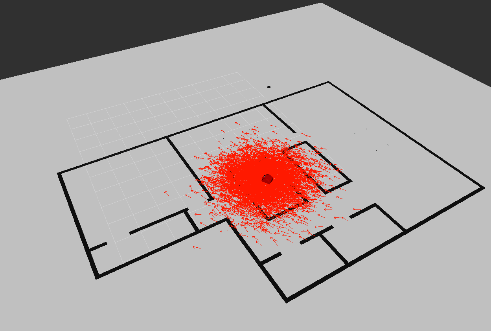
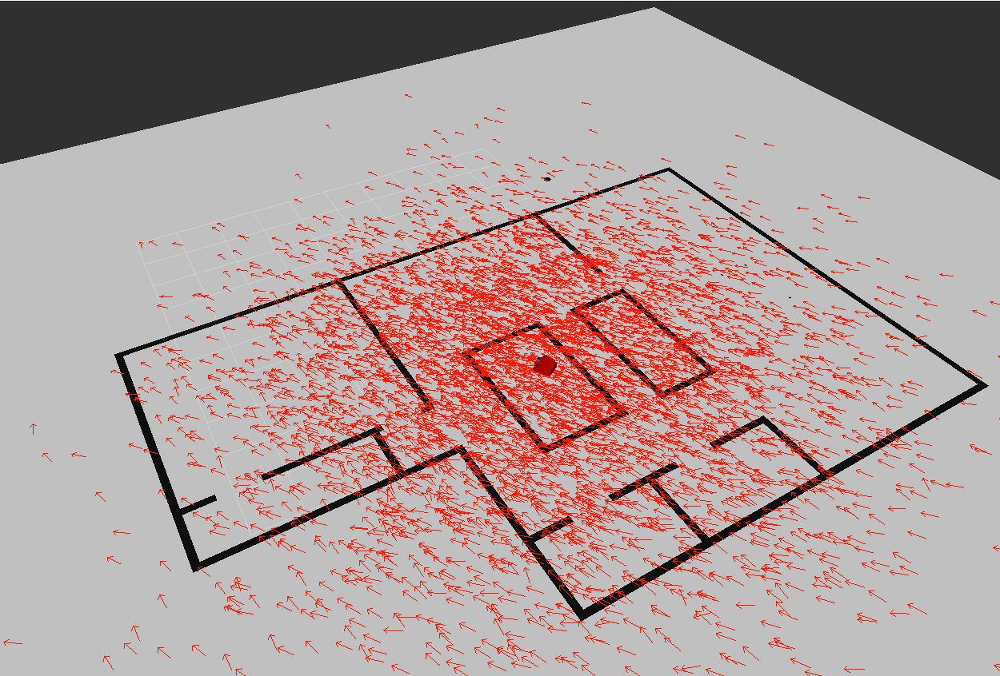
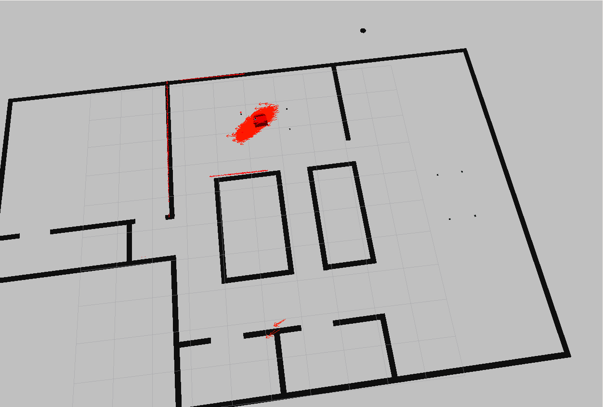
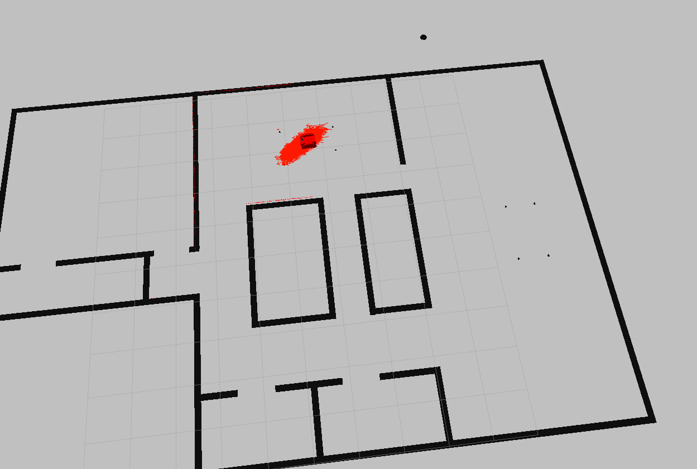
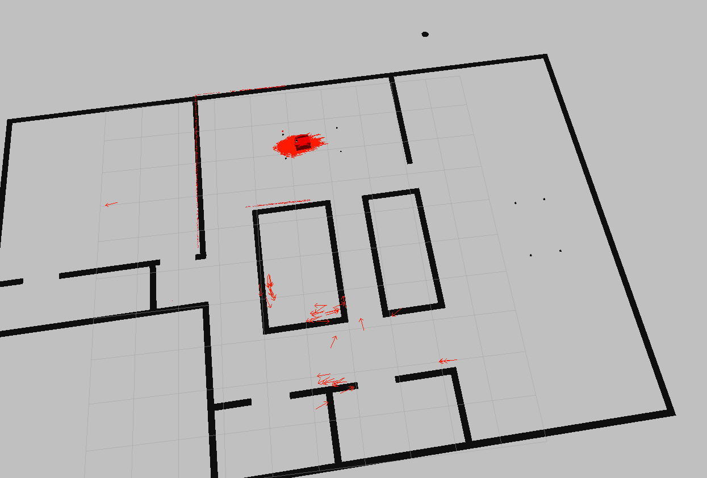
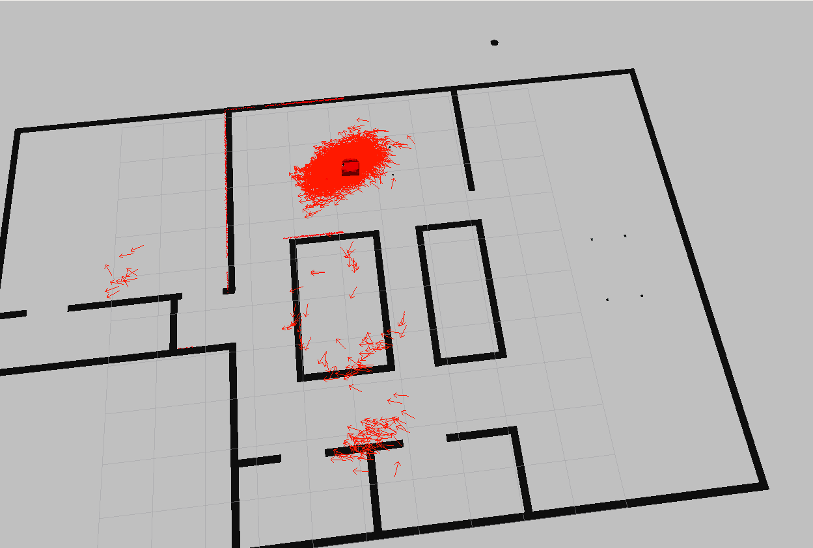

# Introduction
These are some quick notes on what I tried

# Initial Covariance
This parameter had a large impact on the convergenc of the solution because when
it was too small, the actual pose could be outsid of all the guesses and therfore
would not converge.

This image shows a covariance that is too small for the map.

# Min range
The min range did not seem to have an effec. To test this, I started the robot
in a place where there were obsticales close by (under the table). Then I rotated
the robot once and drove back and forth once. The results are shown below.

# Z hit and z rand 
Using the same process of rotating once and then driving back and forth once, I tested
z hit and z rand. Acording to the documenation these must sum to 1 so I tested them
together. When more weight was given to z_hit the solution converged more quickly.

**Z_hit = 1 and Z_rand = 0**

**z_hit = 0.5 and z_rand = 0.5**

# Final results
<video width="320" height="240" controls>
  <source src="final_settings.mp4" type="video/mp4">
</video>